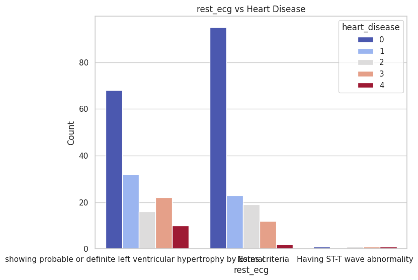
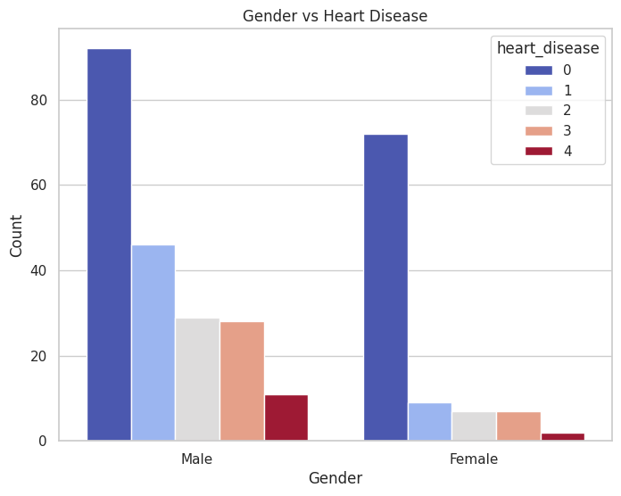
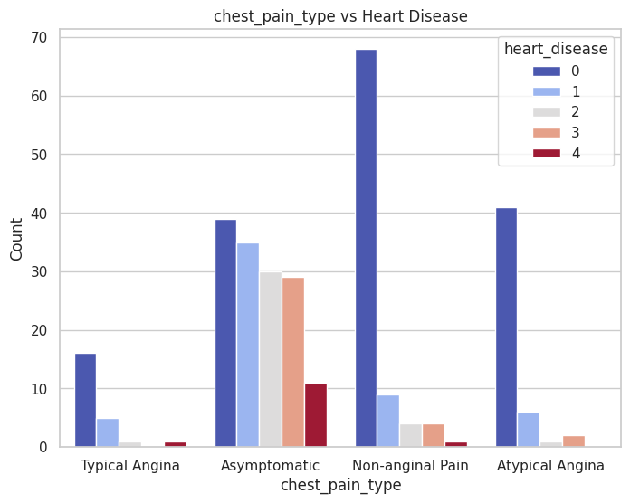
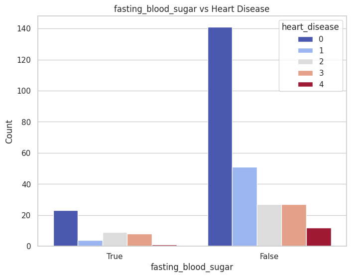

# Heart Health Dataset

This dataset contains clinical and diagnostic information for patients and is commonly used to predict heart disease presence. It includes demographic, diagnostic, and lab result features.

## Dataset Description

### Columns
| **Feature**         | **Description**                                                                                         |
|----------------------|---------------------------------------------------------------------------------------------------------|
| **age**             | Age of the patient in years.                                                                           |
| **sex**             | Sex of the patient:                                                                                     |
|                      | - `1`: Male                                                                                            |
|                      | - `0`: Female                                                                                          |
| **cp**              | Chest pain type:                                                                                        |
|                      | - `1`: Typical angina                                                                                  |
|                      | - `2`: Atypical angina                                                                                 |
|                      | - `3`: Non-anginal pain                                                                                |
|                      | - `4`: Asymptomatic                                                                                    |
| **trestbps**        | Resting blood pressure (in mm Hg) on admission to the hospital.                                         |
| **chol**            | Serum cholesterol level in mg/dl.                                                                      |
| **fbs**             | Fasting blood sugar > 120 mg/dl:                                                                        |
|                      | - `1`: True                                                                                            |
|                      | - `0`: False                                                                                           |
| **restecg**         | Resting electrocardiographic results:                                                                   |
|                      | - `0`: Normal                                                                                          |
|                      | - `1`: ST-T wave abnormality (e.g., T wave inversions, ST elevation or depression > 0.05 mV)            |
|                      | - `2`: Probable or definite left ventricular hypertrophy by Estes' criteria                            |
| **thalach**         | Maximum heart rate achieved during exercise.                                                           |
| **exang**           | Exercise-induced angina:                                                                                |
|                      | - `1`: Yes                                                                                             |
|                      | - `0`: No                                                                                              |
| **oldpeak**         | ST depression induced by exercise relative to rest.                                                    |
| **slope**           | Slope of the peak exercise ST segment:                                                                  |
|                      | - `1`: Upsloping                                                                                       |
|                      | - `2`: Flat                                                                                            |
|                      | - `3`: Downsloping                                                                                     |
| **ca**              | Number of major vessels (0-3) colored by fluoroscopy.                                                  |
| **thal**            | Thalassemia test results:                                                                               |
|                      | - `3`: Normal                                                                                          |
|                      | - `6`: Fixed defect                                                                                    |
|                      | - `7`: Reversible defect                                                                               |
| **heart_disease**   | Diagnosis of heart disease (angiographic disease status):                                               |
|                      | - `0`: < 50% diameter narrowing (no disease)                                                           |
|                      | - `1`: > 50% diameter narrowing (presence of disease)                                                  |
|                      | - `2-4`: Presence of more severe disease categories (based on severity levels).                        |

## Target Variable
- **heart_disease** is the target variable for prediction. Values include:
   - `0`: Absence of heart disease (< 50% narrowing)
   - `1, 2, 3, 4`: Presence of heart disease (> 50% narrowing)

## Usage
This dataset can be used for:
1. **Exploratory Data Analysis (EDA)**: Understanding trends, distributions, and correlations.

## INSIGHTS OF THE DATASET AFTER EXPLORATORY DATA ANALYSIS
-  Significant Predictors of heart disease from the data, from the data, are;
    - patients showing probable or definite left ventricular hypertrophy
    - 

    - Males record a higher number of heart disease 
    - 

    - Patients who are Asymptomatic, patients who doesn't show a sypmtoms of heart disease.
    
     
    - Patients whose Fasting blood Sugar is False
    

## Notable Patterns 
